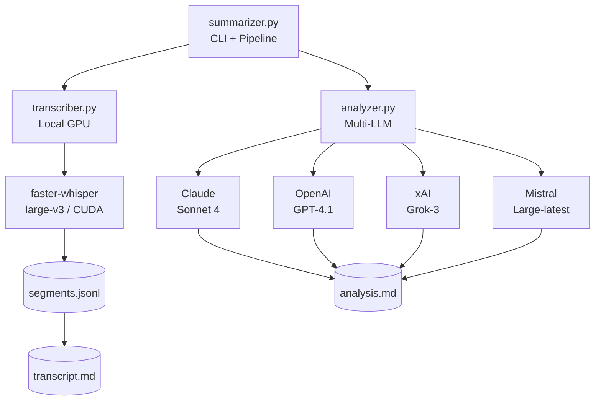
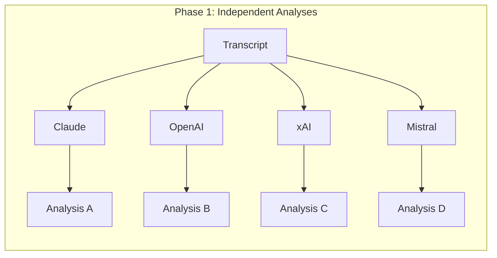
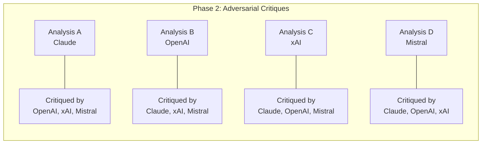
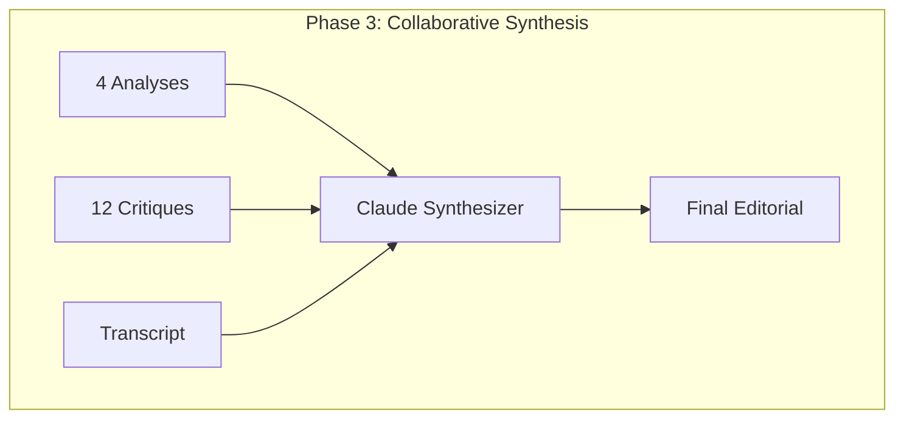
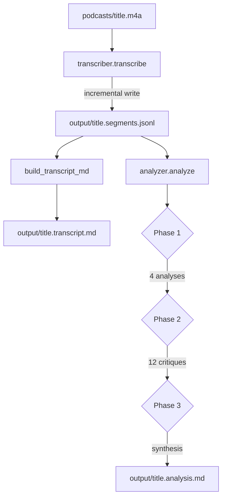
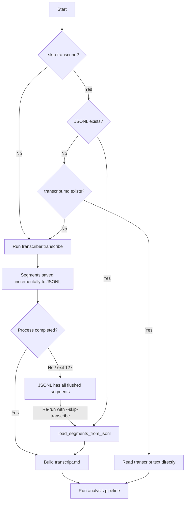

# Architecture

## System Overview

## Module Responsibilities

### config.py

Centralized configuration. Loads API keys from `*.key.txt` files in the project root. Defines Whisper model settings (model size, device, compute type) and directory paths.

No environment variables -- keys are plain files for simplicity and compatibility with the llm_compare project structure.

### transcriber.py

Handles local audio-to-text conversion using faster-whisper (CTranslate2 backend).

Key design decisions:

- **Incremental JSONL output.** Each transcribed segment is flushed to disk immediately via a JSONL file. This is critical because the whisper process frequently exits with code 127 near completion (likely a CUDA/ctranslate2 cleanup issue). The JSONL file preserves all segments regardless.

- **JSONL format.** Line 1 is a metadata record (`{"_info": {...}}`), followed by one segment per line (`{"start", "end", "text"}`). The `load_segments_from_jsonl()` function reconstructs the full transcript from this file.

- **VAD filtering.** Voice Activity Detection skips silence, reducing processing time and improving transcript quality.

- **Progress reporting.** Reports every 5% to avoid flooding stdout (earlier per-segment `\r` output caused buffer issues in non-terminal contexts).

### analyzer.py

Multi-LLM editorial analysis pipeline with three phases:

**Provider abstraction.** The `LLMProvider` class wraps different API clients behind a `generate(system, user) -> str` interface. Anthropic uses its native SDK; OpenAI, xAI, and Mistral all use the OpenAI SDK with different base URLs.

**Auto-discovery.** `get_providers()` attempts to initialize each provider from its key file. Missing or invalid keys are skipped with a warning. The pipeline works with 1-N providers.

**Graceful degradation.** With a single provider, phases 2 and 3 are skipped entirely and the solo analysis is returned directly.

**Prompt architecture.** Three distinct prompt templates:
- `ANALYSIS_PROMPT_TEMPLATE` -- Asks for editorial analysis (Phase 1)
- `CRITIQUE_PROMPT_TEMPLATE` -- Asks for adversarial critique of another analysis (Phase 2)
- `SYNTHESIS_PROMPT_TEMPLATE` -- Asks for final synthesis from all analyses and critiques (Phase 3)

All prompts operate under `RON_DILLEY_SYSTEM_PROMPT`, which defines the editorial voice.

### summarizer.py

CLI entry point and pipeline orchestrator. Coordinates the two-step flow:

1. Transcribe (or load existing JSONL/transcript)
2. Analyze (multi-LLM pipeline)

Handles the `--skip-transcribe` flag by checking for existing JSONL files first (preferred, since they contain structured data), then falling back to existing transcript markdown files.

Builds the transcript markdown document with metadata table, timestamped segments, and full text.

## Data Flow

## Transcription Recovery Flow

## API Call Pattern

With 4 providers, the analysis pipeline makes:

| Phase | API Calls | Purpose |
|-------|-----------|---------|
| Phase 1 | 4 | One analysis per provider |
| Phase 2 | 12 | Each provider critiques the other 3 |
| Phase 3 | 1 | Synthesis by first provider (Claude) |
| **Total** | **17** | |

All calls are sequential (no concurrency) to keep the implementation simple and avoid rate limiting.

## Known Issues

- **Whisper exit code 127.** The faster-whisper process frequently exits with code 127 near 95-100% completion. The incremental JSONL output ensures no data is lost. Root cause is likely a CUDA or ctranslate2 cleanup issue, not a transcription failure.

- **Large transcript context.** The full transcript is sent to each LLM in every phase. For very long podcasts (2+ hours), this may approach context limits on some models. No chunking strategy is currently implemented.
